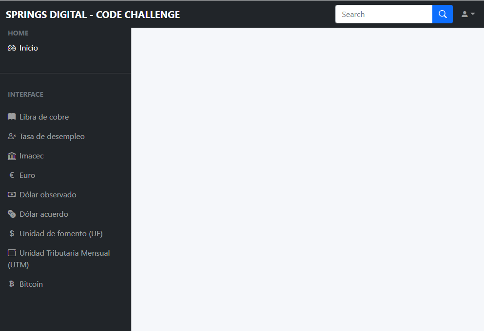

# 👨‍💻 Code Challenge Springs Digital

Para el desafio se debia realizo una aplicación web en donde se interactua con una API entregada por springs digital (https://mindicador.cl/), a la que se realizaron peticion a traves de la función fetch, para posteriormente redenrizar los datos en el dashboard generado para el proyecto.

## 🦾 Dashboard generado

## ✨ Tecnologias
- React 
- Redux
- Wouter
- Create react app
- CSS Vanilla
- useEffect
- Bootstrap
