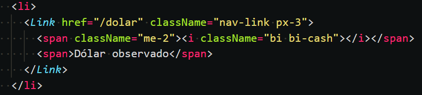

# 👨‍💻 Code Challenge Springs Digital

Para el desafio se realizó una aplicación web en donde se interactua con una API entregada por springs digital (https://mindicador.cl/), a la que se realiza peticiones a traves de la función fetch, para posteriormente redenrizar los datos en el dashboard generado para el proyecto.

Como se ha solicitado se ha usado Redux para la comunicación entre componentes, además se ha optado por utilizar wouter para el redireccionamiento de los diferentes componentes creados para este proyecto.

Cabe mencionar que se ha utilizado la dependencia gh-pages para subir el proyecto generado en react a pages de github, el link se podrá encontrar en el About de este repositorio.

## ✨ Tecnologias
- React 
- Redux
- Wouter
- Create react app
- CSS Vanilla
- useEffect
- Bootstrap
- Hooks
- Gh-pages

## 🦾 Dashboard generado
Se ha generado un Dashboard responsivo con bootstrap.

## Redux

## Hooks - useEffect y setInterval

En el code Challenge se ha solicitado que cada una hora se realice una petición a la API, para esto se ha utilizaso el hook setInterval, el cual cada X milisegundos (3.600.000 que son equivalentes a una hora). volverá a solicitar los datos a la API y popular con los nuevos datos a redux.

## Wouter - Switch, Route y Link

## Request data - fetch

